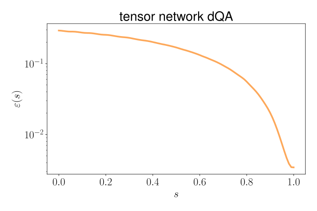
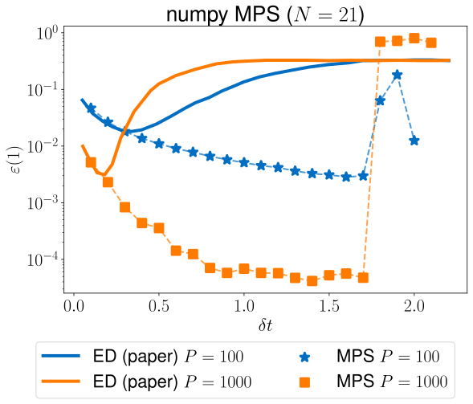

<h1 align="center"> <b>digitized Quantum Annealing via Tensor Network simulations</b> </h1>

<p align="center"><b>Project</b> // Barone Francesco, Coppi Alberto, Zinesi Paolo<br></p>

In this work, we explore the paradigmatic **perceptron model** for binary classification in a quantum computing context. The minimization of the cost function is performed using **Quantum Annealing** (QA), which is one of the most promising frameworks for quantum optimization.

Following the work of [G. Lami et al](https://arxiv.org/abs/2208.14468) (2022), we address the minimization of the complex classical cost function of a *quantum* perceptron model, i.e. we focus on the Hamiltonian
$H = \sum_\mu \Theta(-\xi^\mu\cdot\sigma)\frac{-\xi^\mu\cdot\sigma}{\sqrt{N}}$

As shown in [G. Lami et al](https://arxiv.org/abs/2208.14468), the adiabatic time evolution of QA can be efficiently represented as Matrix Product Operators in a **Tensor Network** framework. Such representation allows for simple classical simulations, well-beyond small sizes amenable to exact diagonalization techniques. Indeed, **discretizing** the QA dynamics (**dQA**) into $P$ steps, we can evolve the initial state towards an optimized Matrix Product State (MPS).

We compute the energy density $\varepsilon(s)$ as a function of the interpolation parameter $s \in [0,1]$. The residual energy density at the end of
the annealing schedule, $\varepsilon(1)$, can be regarded as a figure of merit of dQA effectiveness.

<p align="center">
  
</p>

We validate the results as shown in the reference paper, for various dataset sizes $N$ in the range $8-21$.

<p align="center">
  
</p>

Eventually, we propose a **circuit** to execute the **discretized QA** on a quantum computer. This circuit is probed using a quantum tensor-network emulator developed in Padua, [Quantum Tea Leaves](https://baltig.infn.it/quantum_tea/quantum_tea).

<p align="center">
  
  <br>
  
</p>


### In this repo

```markdown
├── data/            dataset and benchmarks
├── exact-diag/      QA with exact diagonalization
├── img/             plots
├── quimb-dqa/       first implementation of MPS dQA (with Quimb)
│
├─ dQA_mps.py        implementation of dQA with MPS (jax)
└─ dQA_circuit.py    implementation of dQA with Matcha/Qiskit
```


### Setup

Python requirements are listed in `requirements.txt`.

**[Quantum Tea Leaves](https://baltig.infn.it/quantum_tea/quantum_tea)** and **Quantum Matcha Tea** are required to run the `dQA_circuit` implementation. To setup a custom environment, we suggest to take a look at the script `setup-env.sh`, as it should work in most cases.

Our software has been tested with the following software version:
```
qiskit==0.38.0
qmatchatea==0.4.7
qtealeaves==0.4.15
```

Furthermore, in order to use the dQA circuit simulation via Matcha in step-by-step mode, it is necessary to hot-fix the Matcha library itself.
```python
#   fix line 840 of file  qtealeaves.emulator.mps_simulator.py  as
obj = cls(len(tensor_list), 0, conv_params, local_dim)
```

<br><br>

## Bibliography

* G. Lami et al. **"Quantum Annealing for Neural Network optimization problems: a new approach via Tensor Network simulations"**, in SciPost Physics, 2022 ([arxiv:2208.14468](https://arxiv.org/abs/2208.14468))

---

<h5 align="center">Quantum Information and Computing<br>AY 2022/2023 - University of Padua</h5>

<p align="center">
  
  &emsp;
  
</p>
